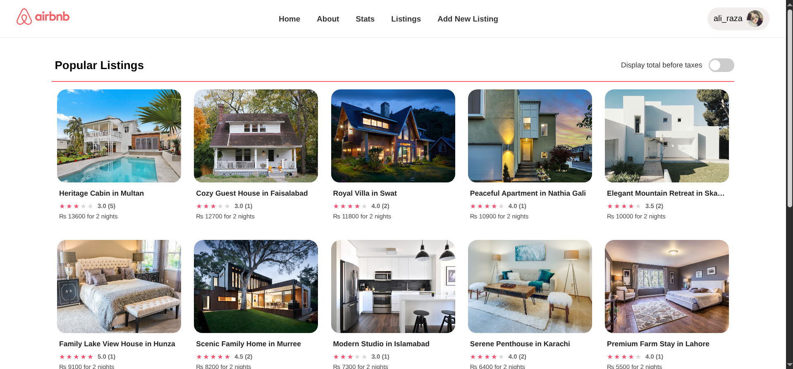
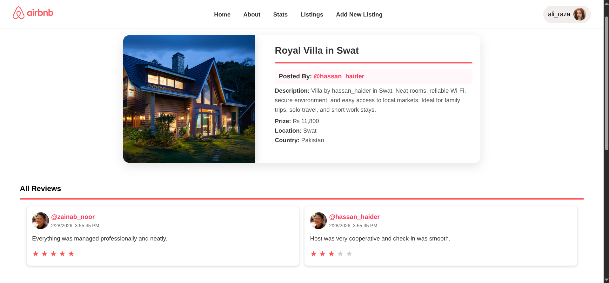
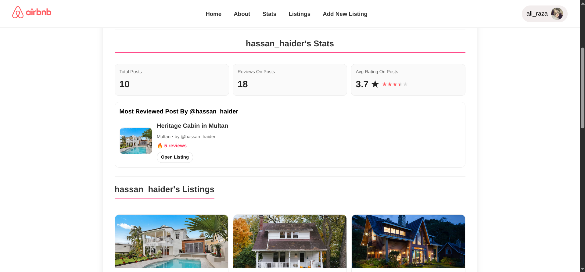

# Wanderlust

Wanderlust is a full-stack listing platform where users can explore places, post listings, leave reviews, and manage profile activity.

## Overview

- Authentication (register, login, logout)
- Listing management (create, edit, view, delete)
- Review and rating system
- User profile with personal posting stats
- Location map integration on listing details

## Tech Stack

- Node.js + Express.js
- MongoDB + Mongoose
- EJS + ejs-mate
- Passport.js (local strategy)
- Multer + Cloudinary

## Run Locally

### 1) Install

```bash
npm install
```

### 2) Environment Variables (`.env`)

```env
ATLAS_URI=your_mongodb_connection_string
SCREAT=your_session_secret
NODE_ENV=development
```

### 3) Start Server

```bash
npm run dev
```

### 4) Seed Database (optional)

```bash
npm run seed
```

## Live Link

Update after deploy:

**Live App:** https://your-project-name.vercel.app

## Health Endpoint

Use this after deployment:

- `GET /health`

It returns runtime + DB status JSON.

## Desktop Preview (2 Rows)

<table>
	<tr>
		<td align="center"></td>
		<td align="center"></td>
	</tr>
	<tr>
		<td align="center"></td>
		<td align="center"></td>
	</tr>
</table>

---

Built by imeer.ai